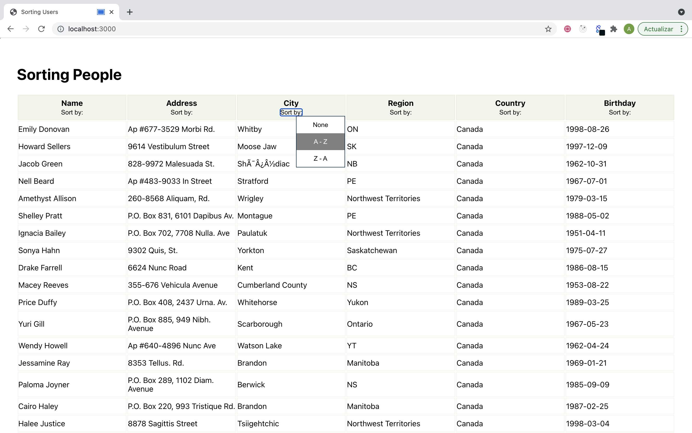

# sorting-users

> A table with sortable columns.

 

This project takes data and then shows it on a table. The data is JSON format and represents fictitious people.

There are six columns: Name, Address, City, Region, Country, and Birthday.

Each column can be sorted, from smallest to the greatest and vice versa. To do it, click on "sort by," and choose an option.

  

## Built With

- React
- JavaScript
- Git
- Jest
- React Testing Library

## Live Demo

[Live Demo Link](https://sorting-people-no4.herokuapp.com)

## Prerequisites

- Node.js installed

## Getting Started

To get a local copy up and running, follow these simple example steps.

- At first, you have to clone this repository. Open your terminal and paste this without the $ sign.

      $ git clone https://github.com/AlejandroNo4/sorting-users.git

- Now that you have the repository in your local machine. Change the direction of the local file with your terminal.  
  Something like:

      $ cd User/Documents/sorting-users

- Now run 

      $npm install

- You are done with the installations! Now to run the project, first type:

      $ npm start

- This will automatically open the app on your browser.

 

## Run Tests

- On the terminal, type:

        $ npm test

- If there is a message that says "No tests found related to files changed since the last commit," press "a"

- Press "q" to quit watch mode.

## Author

👤 **Alejandro Contreras**

- GitHub: [@AlejandroNo4](https://github.com/AlejandroNo4)
- Twitter: [@Alejand80002666](https://twitter.com/Alejand80002666)
- LinkedIn: [Alejandro Contreras Rodriguez](https://www.linkedin.com/in/alejandro-contreras-rodriguez-b524821b5)
